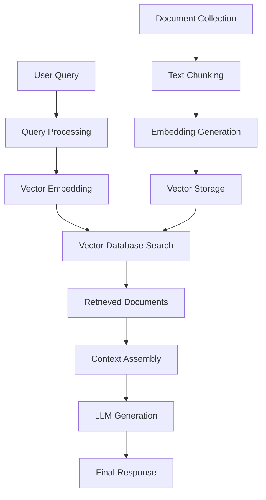
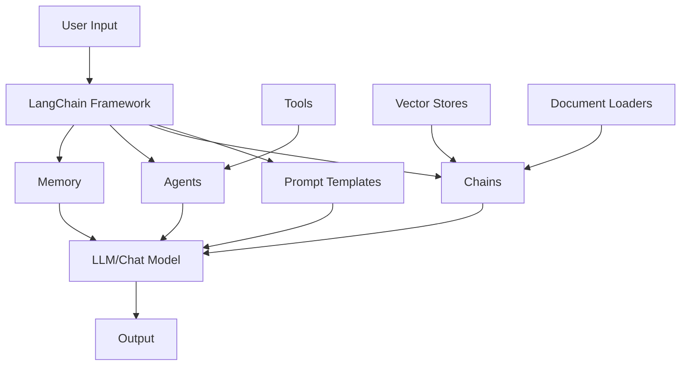
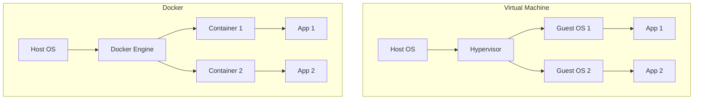

# LLM Roadmap: RAG & Vector Database Applications

**Learning Objective:** To understand how to use LLM models and Google CLI coding agent to develop RAG/Chroma database-based applications

**Due Date:** September 9, 2025

---

## Table of Contents

1. [What is an LLM Model?](#1-what-is-an-llm-model)
2. [What is RAG?](#2-what-is-rag)
3. [What is a Vector Database?](#3-what-is-a-vector-database)
4. [What are Embeddings?](#4-what-are-embeddings)
5. [What is LangChain?](#5-what-is-langchain)
6. [What is Docker?](#6-what-is-docker)
7. [What is Google Gemini CLI?](#7-what-is-google-gemini-cli)
8. [Complete Example Project](#8-complete-example-project)

---

## 1. What is an LLM Model?

### Definition
A **Large Language Model (LLM)** is an artificial intelligence model trained on vast amounts of text data to understand and generate human-like text. These models use deep learning techniques, particularly transformer architectures, to process and generate language.

### Key Characteristics
- **Scale**: Trained on billions of parameters
- **Context Understanding**: Can understand context and maintain conversations
- **Text Generation**: Capable of generating coherent, contextually relevant text
- **Multilingual**: Often supports multiple languages

### Popular LLM Models
- **GPT-4** (OpenAI)
- **Gemini** (Google)
- **Claude** (Anthropic)
- **Llama** (Meta)
- **PaLM** (Google)

### Example Usage
```python
# Example: Using OpenAI GPT-4
import openai

client = openai.OpenAI(api_key="your-api-key")

response = client.chat.completions.create(
    model="gpt-4",
    messages=[
        {"role": "system", "content": "You are a helpful assistant."},
        {"role": "user", "content": "Explain quantum computing in simple terms."}
    ]
)

print(response.choices[0].message.content)
```

---

## 2. What is RAG?

### Definition
**Retrieval-Augmented Generation (RAG)** is a technique that combines the power of large language models with external knowledge retrieval. Instead of relying solely on the model's training data, RAG retrieves relevant information from external sources and uses it to generate more accurate and up-to-date responses.

### How RAG Works

```
User Query → Vector Search → Retrieved Documents → LLM → Enhanced Response
```

### RAG Architecture Diagram



### Benefits of RAG
- **Up-to-date Information**: Access to current data
- **Domain-specific Knowledge**: Can work with specialized documents
- **Reduced Hallucination**: Grounded in retrieved facts
- **Cost-effective**: Reduces need for fine-tuning

### Example Implementation
```python
from langchain.embeddings import OpenAIEmbeddings
from langchain.vectorstores import Chroma
from langchain.text_splitter import RecursiveCharacterTextSplitter
from langchain.chains import RetrievalQA

# Initialize components
embeddings = OpenAIEmbeddings()
text_splitter = RecursiveCharacterTextSplitter(chunk_size=1000, chunk_overlap=200)

# Process documents
documents = text_splitter.split_documents(your_documents)
vectorstore = Chroma.from_documents(documents, embeddings)

# Create RAG chain
qa_chain = RetrievalQA.from_chain_type(
    llm=your_llm,
    chain_type="stuff",
    retriever=vectorstore.as_retriever()
)

# Query
result = qa_chain.run("What is the main topic of the document?")
```

---

## 3. What is a Vector Database?

### Definition
A **vector database** is a specialized database designed to store, index, and query high-dimensional vectors efficiently. These vectors typically represent embeddings of text, images, or other data types.

### Why Vector Databases?
- **Similarity Search**: Find similar items based on vector distance
- **Scalability**: Handle millions of vectors efficiently
- **Real-time Queries**: Fast retrieval for RAG applications
- **Indexing**: Optimized for vector operations

### Types of Vector Databases

#### 1. **Chroma**
- **Type**: Open-source, lightweight
- **Best for**: Prototyping, small to medium applications
- **Features**: Easy setup, Python-first

```python
import chromadb

# Initialize Chroma
client = chromadb.Client()
collection = client.create_collection("documents")

# Add documents
collection.add(
    documents=["Document 1", "Document 2"],
    metadatas=[{"source": "file1"}, {"source": "file2"}],
    ids=["id1", "id2"]
)

# Query
results = collection.query(
    query_texts=["What is machine learning?"],
    n_results=2
)
```

#### 2. **Pinecone**
- **Type**: Cloud-based, managed service
- **Best for**: Production applications, scalability
- **Features**: High performance, automatic scaling

#### 3. **Weaviate**
- **Type**: Open-source, self-hosted or cloud
- **Best for**: Complex queries, multi-modal data
- **Features**: GraphQL API, hybrid search

#### 4. **Qdrant**
- **Type**: Open-source, Rust-based
- **Best for**: High performance, filtering
- **Features**: Fast, memory-efficient

#### 5. **Milvus**
- **Type**: Open-source, distributed
- **Best for**: Large-scale applications
- **Features**: Horizontal scaling, multiple indexes

### Vector Database Comparison

| Database | Type | Scalability | Ease of Use | Performance |
|----------|------|-------------|-------------|-------------|
| Chroma | Open-source | Medium | High | Good |
| Pinecone | Cloud | High | High | Excellent |
| Weaviate | Open-source/Cloud | High | Medium | Excellent |
| Qdrant | Open-source | High | Medium | Excellent |
| Milvus | Open-source | Very High | Low | Excellent |

---

## 4. What are Embeddings?

### Definition
**Embeddings** are dense vector representations of text, images, or other data that capture semantic meaning in a high-dimensional space. Similar concepts are mapped to nearby points in this space.

### How Embeddings Work

```mermaid
graph LR
    A[Text: "The cat sat on the mat"] --> B[Tokenization]
    B --> C[Neural Network]
    C --> D[Vector: [0.1, -0.3, 0.8, ...]]
    
    E[Text: "A feline rested on the rug"] --> F[Tokenization]
    F --> G[Neural Network]
    G --> H[Vector: [0.2, -0.2, 0.7, ...]]
    
    D --> I[Similar Vectors]
    H --> I
```

### Types of Embeddings

#### 1. **Text Embeddings**
- **OpenAI Embeddings**: `text-embedding-ada-002`
- **Sentence Transformers**: Various models
- **Hugging Face**: Multiple embedding models

#### 2. **Multimodal Embeddings**
- **CLIP**: Text and image embeddings
- **DALL-E**: Image generation embeddings

### Example: Creating Embeddings

```python
from sentence_transformers import SentenceTransformer
import numpy as np

# Load model
model = SentenceTransformer('all-MiniLM-L6-v2')

# Create embeddings
sentences = [
    "The cat sat on the mat",
    "A feline rested on the rug",
    "Machine learning is fascinating"
]

embeddings = model.encode(sentences)

# Calculate similarity
similarity = np.dot(embeddings[0], embeddings[1])
print(f"Similarity between sentence 1 and 2: {similarity}")

# Find most similar
def find_most_similar(query_embedding, embeddings):
    similarities = np.dot(query_embedding, embeddings.T)
    most_similar_idx = np.argmax(similarities)
    return most_similar_idx, similarities[most_similar_idx]

query = "A cat on a mat"
query_embedding = model.encode([query])
idx, score = find_most_similar(query_embedding[0], embeddings)
print(f"Most similar sentence: {sentences[idx]} (score: {score})")
```

### Embedding Dimensions
- **OpenAI**: 1536 dimensions
- **Sentence Transformers**: 384-768 dimensions
- **BERT**: 768 dimensions
- **Custom models**: Variable dimensions

---

## 5. What is LangChain?

### Definition
**LangChain** is an open-source framework for building applications with large language models. It provides tools and abstractions to create complex LLM applications easily.

### Why Use LangChain?
- **Modularity**: Reusable components
- **Integration**: Easy integration with various LLMs and tools
- **Chains**: Combine multiple operations
- **Memory**: Maintain conversation context
- **Agents**: Create autonomous AI agents

### Core Components

#### 1. **LLMs and Chat Models**
```python
from langchain.llms import OpenAI
from langchain.chat_models import ChatOpenAI

# Basic LLM
llm = OpenAI(temperature=0.7)

# Chat model
chat = ChatOpenAI(temperature=0.7)
```

#### 2. **Prompts**
```python
from langchain.prompts import PromptTemplate

template = """
You are a helpful assistant that answers questions about {topic}.
Question: {question}
Answer:
"""

prompt = PromptTemplate(
    input_variables=["topic", "question"],
    template=template
)
```

#### 3. **Chains**
```python
from langchain.chains import LLMChain

chain = LLMChain(llm=llm, prompt=prompt)
result = chain.run(topic="machine learning", question="What is deep learning?")
```

#### 4. **Agents**
```python
from langchain.agents import initialize_agent, Tool
from langchain.tools import DuckDuckGoSearchRun

search = DuckDuckGoSearchRun()
tools = [Tool(name="Search", func=search.run, description="Search the web")]

agent = initialize_agent(tools, llm, agent="zero-shot-react-description")
result = agent.run("What is the latest news about AI?")
```

### LangChain Architecture



### Complete LangChain RAG Example

```python
from langchain.document_loaders import TextLoader
from langchain.text_splitter import RecursiveCharacterTextSplitter
from langchain.embeddings import OpenAIEmbeddings
from langchain.vectorstores import Chroma
from langchain.chains import RetrievalQA
from langchain.llms import OpenAI

# Load documents
loader = TextLoader("document.txt")
documents = loader.load()

# Split documents
text_splitter = RecursiveCharacterTextSplitter(
    chunk_size=1000,
    chunk_overlap=200
)
texts = text_splitter.split_documents(documents)

# Create embeddings and vector store
embeddings = OpenAIEmbeddings()
vectorstore = Chroma.from_documents(texts, embeddings)

# Create QA chain
qa_chain = RetrievalQA.from_chain_type(
    llm=OpenAI(),
    chain_type="stuff",
    retriever=vectorstore.as_retriever()
)

# Query
result = qa_chain.run("What is the main topic?")
print(result)
```

---

## 6. What is Docker?

### Definition
**Docker** is a containerization platform that allows you to package applications and their dependencies into lightweight, portable containers. Containers ensure consistent behavior across different environments.

### Key Concepts
- **Container**: Lightweight, portable unit of software
- **Image**: Template for creating containers
- **Dockerfile**: Instructions to build an image
- **Registry**: Repository for Docker images

### Docker vs Virtual Machines



### Docker Setup Guide

#### 1. **Installation**
```bash
# Windows (using Docker Desktop)
# Download from: https://www.docker.com/products/docker-desktop

# Linux (Ubuntu)
sudo apt update
sudo apt install docker.io
sudo systemctl start docker
sudo systemctl enable docker

# Add user to docker group
sudo usermod -aG docker $USER
```

#### 2. **Basic Docker Commands**
```bash
# Check Docker version
docker --version

# List running containers
docker ps

# List all containers
docker ps -a

# List images
docker images

# Pull an image
docker pull python:3.9

# Run a container
docker run -it python:3.9 bash

# Stop a container
docker stop <container_id>

# Remove a container
docker rm <container_id>
```

#### 3. **Creating a Dockerfile**

```dockerfile
# Dockerfile for Python RAG Application
FROM python:3.9-slim

# Set working directory
WORKDIR /app

# Copy requirements first (for better caching)
COPY requirements.txt .

# Install dependencies
RUN pip install --no-cache-dir -r requirements.txt

# Copy application code
COPY . .

# Expose port
EXPOSE 8000

# Run the application
CMD ["python", "app.py"]
```

#### 4. **Docker Compose Example**

```yaml
# docker-compose.yml
version: '3.8'

services:
  app:
    build: .
    ports:
      - "8000:8000"
    environment:
      - OPENAI_API_KEY=${OPENAI_API_KEY}
    volumes:
      - ./data:/app/data
    depends_on:
      - chroma

  chroma:
    image: chromadb/chroma:latest
    ports:
      - "8001:8000"
    volumes:
      - chroma_data:/chroma/chroma

volumes:
  chroma_data:
```

#### 5. **Building and Running**

```bash
# Build image
docker build -t rag-app .

# Run container
docker run -p 8000:8000 -e OPENAI_API_KEY=your_key rag-app

# Using Docker Compose
docker-compose up --build

# Run in background
docker-compose up -d
```

### Docker Best Practices
- Use `.dockerignore` to exclude unnecessary files
- Use multi-stage builds for smaller images
- Don't run as root in containers
- Use specific version tags
- Keep containers stateless

---

## 7. What is Google Gemini CLI?

### Definition
**Google Gemini CLI** is a command-line interface for interacting with Google's Gemini AI models. It allows developers to use Gemini's capabilities directly from the terminal or integrate it into scripts and applications.

### Key Features
- **Text Generation**: Create content, answer questions
- **Code Generation**: Generate and explain code
- **Multimodal**: Handle text, images, and other media
- **API Integration**: Easy integration with applications

### Installation and Setup

#### 1. **Installation**
```bash
# Install via npm
npm install -g @google/generative-ai

# Or via pip
pip install google-generativeai

# Or download binary from GitHub
# https://github.com/google/generative-ai-cli
```

#### 2. **Authentication**
```bash
# Set up API key
export GOOGLE_API_KEY="your-api-key"

# Or create .env file
echo "GOOGLE_API_KEY=your-api-key" > .env
```

#### 3. **Basic Usage**
```bash
# Text generation
gemini generate "Explain quantum computing"

# Code generation
gemini code "Create a Python function to sort a list"

# Interactive mode
gemini interactive

# File processing
gemini process document.txt

# Image analysis
gemini analyze image.jpg "What do you see in this image?"
```

### Python Integration Example

```python
import google.generativeai as genai
import os

# Configure API key
genai.configure(api_key=os.getenv("GOOGLE_API_KEY"))

# Initialize model
model = genai.GenerativeModel('gemini-pro')

# Text generation
response = model.generate_content("Explain machine learning in simple terms")
print(response.text)

# Code generation
code_prompt = """
Create a Python function that implements a simple RAG system using ChromaDB.
Include error handling and return the most relevant documents.
"""

code_response = model.generate_content(code_prompt)
print(code_response.text)

# Multimodal example
multimodal_model = genai.GenerativeModel('gemini-pro-vision')

# Analyze image with text
image = genai.upload_file("chart.png")
response = multimodal_model.generate_content([
    "Analyze this chart and explain the trends",
    image
])
print(response.text)
```

### Advanced Features

#### 1. **Streaming Responses**
```python
response = model.generate_content(
    "Write a detailed explanation of neural networks",
    stream=True
)

for chunk in response:
    print(chunk.text, end="")
```

#### 2. **Custom Parameters**
```python
generation_config = genai.types.GenerationConfig(
    temperature=0.7,
    top_p=0.8,
    top_k=40,
    max_output_tokens=1024,
)

response = model.generate_content(
    "Create a creative story",
    generation_config=generation_config
)
```

#### 3. **Safety Settings**
```python
safety_settings = [
    {
        "category": "HARM_CATEGORY_HARASSMENT",
        "threshold": "BLOCK_MEDIUM_AND_ABOVE"
    },
    {
        "category": "HARM_CATEGORY_HATE_SPEECH",
        "threshold": "BLOCK_MEDIUM_AND_ABOVE"
    },
]

response = model.generate_content(
    "Your prompt here",
    safety_settings=safety_settings
)
```

### Integration with RAG Systems

```python
import google.generativeai as genai
from langchain.vectorstores import Chroma
from langchain.embeddings import GoogleGenerativeAIEmbeddings

# Initialize Gemini components
genai.configure(api_key=os.getenv("GOOGLE_API_KEY"))
model = genai.GenerativeModel('gemini-pro')
embeddings = GoogleGenerativeAIEmbeddings(model="models/embedding-001")

# Create vector store
vectorstore = Chroma.from_documents(documents, embeddings)

# RAG with Gemini
def rag_with_gemini(query):
    # Retrieve relevant documents
    docs = vectorstore.similarity_search(query, k=3)
    context = "\n".join([doc.page_content for doc in docs])
    
    # Generate response with Gemini
    prompt = f"""
    Context: {context}
    
    Question: {query}
    
    Answer based on the provided context:
    """
    
    response = model.generate_content(prompt)
    return response.text

# Usage
result = rag_with_gemini("What is the main topic?")
print(result)
```

---

## 8. Complete Example Project

### Project Structure
```
rag-project/
├── app.py
├── requirements.txt
├── Dockerfile
├── docker-compose.yml
├── data/
│   └── documents/
│       ├── doc1.txt
│       └── doc2.txt
├── src/
│   ├── __init__.py
│   ├── document_processor.py
│   ├── vector_store.py
│   └── rag_chain.py
└── README.md
```

### Complete Implementation

#### 1. **requirements.txt**
```txt
langchain==0.1.0
chromadb==0.4.15
google-generativeai==0.3.2
python-dotenv==1.0.0
streamlit==1.28.0
sentence-transformers==2.2.2
```

#### 2. **src/document_processor.py**
```python
from langchain.document_loaders import DirectoryLoader, TextLoader
from langchain.text_splitter import RecursiveCharacterTextSplitter
from typing import List
from langchain.schema import Document

class DocumentProcessor:
    def __init__(self, chunk_size: int = 1000, chunk_overlap: int = 200):
        self.text_splitter = RecursiveCharacterTextSplitter(
            chunk_size=chunk_size,
            chunk_overlap=chunk_overlap
        )
    
    def load_documents(self, directory_path: str) -> List[Document]:
        """Load documents from directory"""
        loader = DirectoryLoader(
            directory_path,
            glob="**/*.txt",
            loader_cls=TextLoader
        )
        return loader.load()
    
    def split_documents(self, documents: List[Document]) -> List[Document]:
        """Split documents into chunks"""
        return self.text_splitter.split_documents(documents)
```

#### 3. **src/vector_store.py**
```python
import chromadb
from chromadb.config import Settings
from langchain.embeddings import GoogleGenerativeAIEmbeddings
from langchain.vectorstores import Chroma
from typing import List
from langchain.schema import Document
import os

class VectorStoreManager:
    def __init__(self, persist_directory: str = "./chroma_db"):
        self.persist_directory = persist_directory
        self.embeddings = GoogleGenerativeAIEmbeddings(
            model="models/embedding-001"
        )
        self.vectorstore = None
    
    def create_vectorstore(self, documents: List[Document]):
        """Create vector store from documents"""
        self.vectorstore = Chroma.from_documents(
            documents=documents,
            embedding=self.embeddings,
            persist_directory=self.persist_directory
        )
        return self.vectorstore
    
    def load_vectorstore(self):
        """Load existing vector store"""
        self.vectorstore = Chroma(
            persist_directory=self.persist_directory,
            embedding_function=self.embeddings
        )
        return self.vectorstore
    
    def similarity_search(self, query: str, k: int = 3):
        """Search for similar documents"""
        if not self.vectorstore:
            raise ValueError("Vector store not initialized")
        return self.vectorstore.similarity_search(query, k=k)
```

#### 4. **src/rag_chain.py**
```python
import google.generativeai as genai
from typing import List
import os

class RAGChain:
    def __init__(self, vector_store_manager):
        genai.configure(api_key=os.getenv("GOOGLE_API_KEY"))
        self.model = genai.GenerativeModel('gemini-pro')
        self.vector_store = vector_store_manager
    
    def generate_response(self, query: str) -> str:
        """Generate response using RAG"""
        # Retrieve relevant documents
        docs = self.vector_store.similarity_search(query, k=3)
        context = "\n\n".join([doc.page_content for doc in docs])
        
        # Create prompt
        prompt = f"""
        Context Information:
        {context}
        
        Question: {query}
        
        Please answer the question based on the provided context. 
        If the context doesn't contain enough information, 
        please say so and provide a general answer.
        
        Answer:
        """
        
        # Generate response
        response = self.model.generate_content(prompt)
        return response.text
    
    def get_sources(self, query: str) -> List[str]:
        """Get source documents for a query"""
        docs = self.vector_store.similarity_search(query, k=3)
        return [doc.metadata.get('source', 'Unknown') for doc in docs]
```

#### 5. **app.py**
```python
import streamlit as st
import os
from dotenv import load_dotenv
from src.document_processor import DocumentProcessor
from src.vector_store import VectorStoreManager
from src.rag_chain import RAGChain

# Load environment variables
load_dotenv()

def main():
    st.set_page_config(page_title="RAG Application", page_icon="🤖")
    st.title("RAG Application with Gemini")
    
    # Initialize components
    if 'rag_chain' not in st.session_state:
        with st.spinner("Initializing RAG system..."):
            # Process documents
            processor = DocumentProcessor()
            documents = processor.load_documents("./data/documents")
            chunks = processor.split_documents(documents)
            
            # Create vector store
            vector_manager = VectorStoreManager()
            vector_manager.create_vectorstore(chunks)
            
            # Create RAG chain
            st.session_state.rag_chain = RAGChain(vector_manager)
            st.session_state.initialized = True
    
    # Chat interface
    st.subheader("Ask a question about your documents")
    
    # Input
    query = st.text_input("Your question:", placeholder="What is the main topic?")
    
    if st.button("Ask") and query:
        with st.spinner("Generating response..."):
            # Generate response
            response = st.session_state.rag_chain.generate_response(query)
            sources = st.session_state.rag_chain.get_sources(query)
            
            # Display response
            st.subheader("Answer:")
            st.write(response)
            
            # Display sources
            st.subheader("Sources:")
            for i, source in enumerate(sources, 1):
                st.write(f"{i}. {source}")

if __name__ == "__main__":
    main()
```

#### 6. **Dockerfile**
```dockerfile
FROM python:3.9-slim

WORKDIR /app

# Install system dependencies
RUN apt-get update && apt-get install -y \
    gcc \
    && rm -rf /var/lib/apt/lists/*

# Copy requirements and install Python dependencies
COPY requirements.txt .
RUN pip install --no-cache-dir -r requirements.txt

# Copy application code
COPY . .

# Create data directory
RUN mkdir -p data/documents

# Expose port
EXPOSE 8501

# Run the application
CMD ["streamlit", "run", "app.py", "--server.port=8501", "--server.address=0.0.0.0"]
```

#### 7. **docker-compose.yml**
```yaml
version: '3.8'

services:
  rag-app:
    build: .
    ports:
      - "8501:8501"
    environment:
      - GOOGLE_API_KEY=${GOOGLE_API_KEY}
    volumes:
      - ./data:/app/data
      - ./chroma_db:/app/chroma_db
    restart: unless-stopped
```

### Running the Project

#### 1. **Local Development**
```bash
# Install dependencies
pip install -r requirements.txt

# Set environment variables
export GOOGLE_API_KEY="your-api-key"

# Add some documents to data/documents/
echo "This is a sample document about machine learning." > data/documents/sample.txt

# Run the application
streamlit run app.py
```

#### 2. **Docker Deployment**
```bash
# Build and run with Docker Compose
docker-compose up --build

# Access the application at http://localhost:8501
```

### Testing the Application

1. **Add Documents**: Place text files in `data/documents/`
2. **Ask Questions**: Use the chat interface to ask questions
3. **View Sources**: Check which documents were used for answers
4. **Test Different Queries**: Try various types of questions

---

## Summary

This roadmap covers all the essential topics for building RAG applications:

1. **LLM Models**: Understanding large language models and their capabilities
2. **RAG**: Implementing retrieval-augmented generation for better responses
3. **Vector Databases**: Choosing and using the right vector database
4. **Embeddings**: Creating and using vector representations
5. **LangChain**: Building complex LLM applications with modular components
6. **Docker**: Containerizing applications for consistent deployment
7. **Google Gemini CLI**: Leveraging Google's AI models effectively

The complete example project demonstrates how all these components work together to create a functional RAG application that can answer questions based on your documents using Google's Gemini model.

---

## Next Steps

1. **Experiment**: Try different embedding models and vector databases
2. **Scale**: Implement more sophisticated document processing
3. **Optimize**: Fine-tune retrieval and generation parameters
4. **Deploy**: Use cloud services for production deployment
5. **Monitor**: Implement logging and performance monitoring

**Happy Learning! 🚀**
